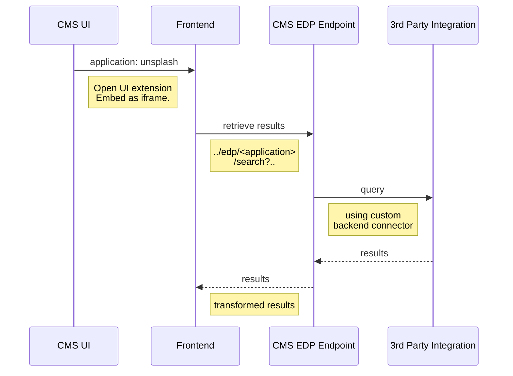

`Note: please check if the UI extension is using the supported frontend url ` https://github.com/ksalic/brxm-open-ui-external-document-picker#release-notes

# Documentation BrXM External Document Picker (Open UI)  
  
Welcome to the documentation page of the External Document Picker (Re-created with Open UI)  
    
The External Document Picker is a feature where you can select external resources and embed information from those external resources onto a document in BrXM. 

Think about integrations with systems such as:  DAM (digital asset management) systems. Or PIM (Product Information Management) Systems. Where you have the website which is maintained in BrXM and you can select information from other systems to be included in the site with a link, url or id.
    
Previously we have had great success with our long lasting [External Document Picker Plugin (Original)](https://github.com/bloomreach-forge/external-document-picker)  
 
Now we feel there is a time for a new and refurbished UI to the features the external document picker offers us.  

This External Document Picker plugin, such as the previous, is mainly targeted for back end (Java) developers  who do not want to write any frontend UI code and logic. The plugin offers a generic UI and allows the developer to **create connectors** to 3rd Party Solutions by implementing a very simple API. 
Of course as a frontend developer you can take the source code of the picker, written in React using Material UI and tweak it to your own needs.
  
**Short Demo:**  
  
  
  
 ## OOTB Integrations

In this project we have included 2 examples with 3rd party integrations: [Unsplash.com]([https://unsplash.com/](https://unsplash.com/)) and [Giphy](https://giphy.com/)
  
## Build & RUN  - Dependencies and Demo
  
### Build External Document Picker Dependencies  

     mvn clean install  

### Running External Document Picker UI frontend  

     cd frontend 
     npm install 
     npm run start

### Run Demo Project   

     cd demo 
     mvn clean verify 
     mvn -P cargo.run  
     
## Install to your project  

In the root pom.xml

```xml
<repositories>
 
  <!-- SNIP -->
 
  <repository>
    <id>hippo-maven2-forge</id>
    <name>Hippo Maven 2 Repository</name>
    <url>https://maven.onehippo.com/maven2-forge/</url>
  </repository>
 
  <!-- SNIP -->
 
</repositories>
```

In the cms pom.xml add the following dependencies

API dependency (required):

    <dependency>  
     <groupId>com.bloomreach.openui</groupId>  
     <artifactId>openui-external-document-picker-api</artifactId>  
     <version>${edp.version}</version>  
    </dependency>

 Unsplash.com dependency (optional):

    <dependency>  
     <groupId>com.bloomreach.openui</groupId>  
     <artifactId>openui-external-document-picker-unsplashed-cms</artifactId>  
     <version>${edp.version}</version>  
    </dependency>

 Giphy dependency (optional):

	   <dependency>  
         <groupId>com.bloomreach.openui</groupId>  
         <artifactId>openui-external-document-picker-giphy-cms</artifactId>  
         <version>${edp.version}</version>  
       </dependency>
       
 brSM Product Picker dependency (optional):
 
 	   <dependency>  
          <groupId>com.bloomreach.openui</groupId>  
          <artifactId>openui-external-document-picker-brsm-cms</artifactId>  
          <version>${edp.version}</version>  
        </dependency>
 

 In the site/components pom.xml add the following (optional) dependencies:
 

    <dependency>  
     <groupId>com.bloomreach.openui</groupId>  
     <artifactId>openui-external-document-picker-unsplashed-site</artifactId>  
     <version>${edp.version}</version>  
    </dependency> 
     
    <dependency>  
     <groupId>com.bloomreach.openui</groupId>  
     <artifactId>openui-external-document-picker-giphy-site</artifactId>  
     <version>${edp.version}</version>  
    </dependency>
    
    
 ## Important for _v14+_ users!
 For brX version **14.0.0** and newer, a domain rule needs to be added to allow the API access to the openUI nodes. This can be done with the following steps: 
 
 1. In the console, go to **hippo:configuration > hippo:domains > live-documents**
 2. Import the following YAML snippet:
 
 ~~~
    /hippo:configuration/hippo:domains/hst-live-documents/openui:
      jcr:primaryType: hipposys:domainrule
      /openui-read:
        jcr:primaryType: hipposys:facetrule
        hipposys:equals: true
        hipposys:facet: jcr:path
        hipposys:type: Reference
        hipposys:value: /hippo:configuration/hippo:frontend/cms/ui-extensions
 ~~~
3. Done! Now you should be able to use the Open UI plugins in v14!

 ## Configure

Example: add Unsplash Picker to a News item:

**Prerequisites**: Installed the cms and site dependencies for unslash.com (see above)

 1. Log in to the console and find the unsplash CRISP configuration


*/hippo:configuration/hippo:modules/crispregistry/hippo:moduleconfig/crisp:resourceresolvercontainer/unsplashed*

 2. Edit the client.id (abc123) to match the **Access Key** supplied by your unsplash [developer account](https://unsplash.com/developers)
 3. Login to the CMS, navigate to the document type section and find a document which you want to add the picker to and go into edit mode.
 4. Select **unsplashed** from the right sidebar in the compound section


5. Done and Commit. The picker should now be available to each News item in the BrXM instance.

For Giphy use the same approach.

For _brSM_, make sure to fill the parameters of the productPicker CRISP module with your API instance's details.

## Create Your Own 3rd Party Integration

The following section will go to how to create your own integration with a 3rd Party. Before we go into creating your own external document picker extension we will explain on how it works.

### Resources

Before we start going into the details on how to create you own integration with the Open UI External Document Picker make sure to read through the official documentation:

[https://documentation.bloomreach.com/library/concepts/open-ui/introduction.html](https://documentation.bloomreach.com/library/concepts/open-ui/introduction.html)


### Register the Open UI Extension in the CMS

The first thing that is required is to register the Open UI extension point in the CMS.

1. Go to the console and navigate to:

*/hippo:configuration/hippo:frontend/cms/ui-extensions*

2. Import the following snippet and replace all the parts with `<application>` with the name of the integration you wish to create:

```yaml
/hippo:configuration/hippo:frontend/cms/ui-extensions/<application>:  
  jcr:primaryType: frontend:uiExtension  
  jcr:mixinTypes: ['hippostd:relaxed']  
  frontend:clientid: abc123  
  frontend:config: '{"dataMode":"multiple", "autoSearch":false, "title":"<application> Image Picker","size":"large",
                      "application": "<application>", "query": "hippo", "pageSize" :"16", "clientId": "abc123"}'`  
  frontend:displayName: External Document Picker  
  frontend:extensionPoint: document.field  
  frontend:initialHeightInPixels: 200  
  frontend:url: http://<frontend-url>

```

In the above snippet we are registering an Open UI extension to be used in the CMS.

in the **frontend:config** we are specifying the JSON string which the frontend application (external document picker frontend ui) is going to receive during initialisation of the UI. 

| property | value | comment |
|--|--|--|
|dataMode  | single or multiple | Depending if you would like to select a single or multiple items in the external document picker. |
|autoSearch  | true or false (default true) | If unset or set to true new requests fire while the user types in the search bar. If false the search fires only on Enter key press.|
|title | X Picker | The title of the dialog |
|size | small, medium or large| Size of the Dialog |
|application | foo | Name of the 3rd party connector developed. E.g. unsplash: {... ,application: unsplash}. This corresponds with the value of @Path annotation in the Rest Resource (see below) |
| query | hippo | Default query executed when dialog instantiated |
| pageSize | 16 | Default limit  used for pagination in the infinite scroll feature |
|cliendId | foobar123 | the same value as the  `frontend:clientid: abc123` property. Used for (simple authentication purposes) |

The **frontend:url** is the property which is pointing towards the frontend application. If you are running the frontend application locally on http://localhost:3002 then the value should be `frontend:url: http://localhost:3002`. Check the release notes (below) which frontend application is already deployed and you can use the link directly e.g.: [http://brxm-extdoc-pickerv0.2.s3-website-eu-west-1.amazonaws.com](http://brxm-extdoc-pickerv0.2.s3-website-eu-west-1.amazonaws.com/)

### Connector API

To use the Java API you will need to implement the 2 interfaces from the API dependency. The implementation will serve as a **connector**

**[com.bloomreach.cms.openui.rest.PickerItem](https://github.com/ksalic/brxm-open-ui-external-document-picker/blob/master/api/src/main/java/com/bloomreach/cms/openui/rest/PickerItem.java)**

    public interface PickerItem<T> {  
   
        public String getId();  
        public String getTitle();  
        public String getImage();  
        public String getDescription();  
        public T getData();  
    }

**[com.bloomreach.cms.openui.rest.ExternalDocumentPickerResource](https://github.com/ksalic/brxm-open-ui-external-document-picker/blob/master/api/src/main/java/com/bloomreach/cms/openui/rest/ExternalDocumentPickerResource.java)**

    public interface ExternalDocumentPickerResource<T extends PickerItem> {  
      
        @GET  
        @Path("/search")  
        @Produces({MediaType.APPLICATION_JSON})  
        public List<T> search(@QueryParam("query") String query,  
                @QueryParam("page") @DefaultValue("1") int page,  
                @QueryParam("pageSize") @DefaultValue("16") int pageSize);  
    }

Example:

 - Unsplash
	 - [https://github.com/ksalic/brxm-open-ui-external-document-picker/blob/master/unsplashed-cms/src/main/java/com/bloomreach/cms/openui/rest/unsplashed/UnsplashedExternalDocumentPickerResource.java](https://github.com/ksalic/brxm-open-ui-external-document-picker/blob/master/unsplashed-cms/src/main/java/com/bloomreach/cms/openui/rest/unsplashed/UnsplashedExternalDocumentPickerResource.java)
	 - [https://github.com/ksalic/brxm-open-ui-external-document-picker/blob/master/unsplashed-cms/src/main/java/com/bloomreach/cms/openui/rest/unsplashed/UnsplashedPickerItemAdapter.java](https://github.com/ksalic/brxm-open-ui-external-document-picker/blob/master/unsplashed-cms/src/main/java/com/bloomreach/cms/openui/rest/unsplashed/UnsplashedPickerItemAdapter.java)
- Giphy
	- [https://github.com/ksalic/brxm-open-ui-external-document-picker/blob/master/giphy-cms/src/main/java/com/bloomreach/cms/openui/rest/giphy/GiphyExternalDocumentPickerResource.java](https://github.com/ksalic/brxm-open-ui-external-document-picker/blob/master/giphy-cms/src/main/java/com/bloomreach/cms/openui/rest/giphy/GiphyExternalDocumentPickerResource.java)
	- [https://github.com/ksalic/brxm-open-ui-external-document-picker/blob/master/giphy-cms/src/main/java/com/bloomreach/cms/openui/rest/giphy/GiphyPickerItemAdapter.java](https://github.com/ksalic/brxm-open-ui-external-document-picker/blob/master/giphy-cms/src/main/java/com/bloomreach/cms/openui/rest/giphy/GiphyPickerItemAdapter.java)

####  Client Connector

To create the client connectors we recommend you use CRISP as in above examples with unsplash and giphy. More about CRISP: [https://documentation.bloomreach.com/library/concepts/crisp-api/introduction.html](https://documentation.bloomreach.com/library/concepts/crisp-api/introduction.html)

### EDP (Mount) Endpoint

To register your custom connector you will need to register the implementation of ExternalDocumentPickerResource to the `JaxrsRestOpenUiPipeline`. You can do this by adding a XML snippet in your code

Example of unsplash: [https://github.com/ksalic/brxm-open-ui-external-document-picker/blob/master/unsplashed-cms/src/main/resources/META-INF/hst-assembly/overrides/addon/com/bloomreach/cms/openui/rest/spring-openui-rest-pipeline-unsplashed.xml](https://github.com/ksalic/brxm-open-ui-external-document-picker/blob/master/unsplashed-cms/src/main/resources/META-INF/hst-assembly/overrides/addon/com/bloomreach/cms/openui/rest/spring-openui-rest-pipeline-unsplashed.xml)

When completed, rebuild and run. The endpoint should be available and retrieving results from the 3rd party service: 

[http://localhost:8080/cms/edp/unsplashed/search?query=hippo&clientId=qwerty123](http://localhost:8080/cms/edp/unsplashed/search?query=hippo&clientId=qwerty123)

> Make sure the clientId property matches the same one as the frontend:clientid in ui-extension configuration in the console.

This REST resource will return results in a structured way for the (picker) frontend UI to consume. It will always need an id, title and image to render the view (description is optional). This means that in your connector you need to transform the 3rd party response to suit the PickerItem model. 

### How it works (Sequence):

  
 


 
## Release Notes

| CMS Version| External Document Picker Version| Frontend URL | Release Notes
|--|--|--|--|
| 13.4.x | 0.4.0 | [https://dv2becjeusob0.cloudfront.net](https://dv2becjeusob0.cloudfront.net) | re-orderable items, selected items in dialog, dialog view improved |
| 14.0.x | 0.5.0 | [https://dv2becjeusob0.cloudfront.net](https://dv2becjeusob0.cloudfront.net) | Included brSM product picker (no beans) |
| 14.1.x | 0.6.0 | [https://dv2becjeusob0.cloudfront.net](https://dv2becjeusob0.cloudfront.net) | added extra option in the api such as: documentLocale  |
| 14.1.x | 0.7.0 | [https://d381zp6o8iqqvl.cloudfront.net/](https://d381zp6o8iqqvl.cloudfront.net) | Facets and Filters supported, please not that this requires an update on existing backend code |
| 14.1.x | 0.7.0 | [https://d381zp6o8iqqvl.cloudfront.net/](https://d381zp6o8iqqvl.cloudfront.net) | Control when search requests fire with autoSearch property |

## Feature Requests:

1. List and Data view in Dialog
2. Improved ui in document field (now using chips)
3. CKeditor Support
4. Custom Dialog result view (i.e. video support)

Let me know if you have more?
